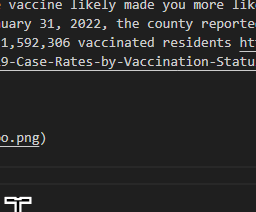

### Santa Clara County related files

The COVID_infections file obtained by a FOIA request to teh SCC PHD shows that 98% of the people who were diagnosed with covid were vaccinated for COVID in January of 2022. This is problematic because at that time only 86% had been vaccinated. So the vaccine likely made you more likely to get COVID. Specifically, On January 31, 2022, the county reported 265,032 unvaccinated residents and 1,592,306 vaccinated residents https://data.sccgov.org/COVID-19/Covid-19-Case-Rates-by-Vaccination-Status/vad9-q7m4/data_preview

