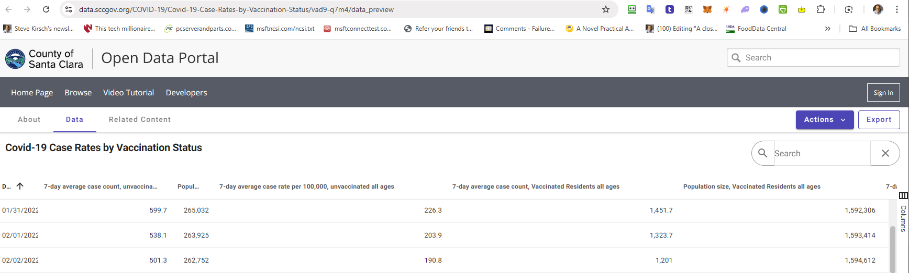
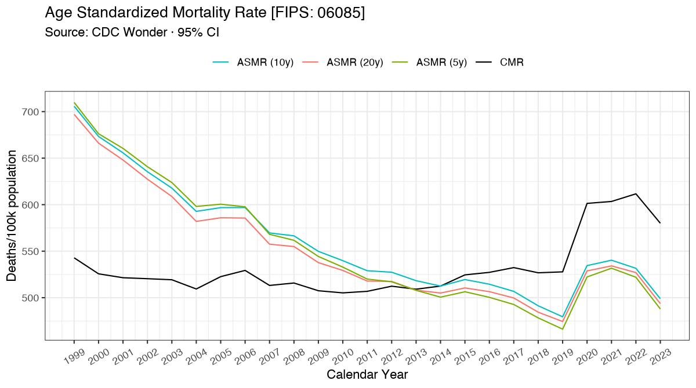

# Santa Clara County related files

### PROBLEM 1: The vaccine increased your risk of getting COVID
The FOIA_response_SCC_COVID_infections_Jan_2022 file obtained by a FOIA request to the SCC PHD shows that **98%** of the people who were diagnosed with covid were vaccinated for COVID in January of 2022. This is problematic because at that time only **86% had been vaccinated**. So the vaccine likely made you more likely to get COVID. Specifically, on January 31, 2022, the county reported 265,032 unvaccinated residents and 1,592,306 vaccinated residents:

[Reference](https://data.sccgov.org/COVID-19/Covid-19-Case-Rates-by-Vaccination-Status/vad9-q7m4/data_preview)

I reached out to the epidemiologist who prepared the FOIA report, and she promised to have someone get back to me to explain it. When I contacted her again to notify her nobody contacted me, she blocked me. 

When I asked SCC PHD media relations to explain this, they ignored me. When County Supervisor Simitian's office asked about it, they said, "No comment." When the County Executive's office asked about it, they said, "No comment." The liason in the County Executive's office said that "No comment" was a perfectly acceptable response. 

### PROBLEM 2: The CFR went up by 50% from December in the month(s) after the COVID shots rolled out. 

Here's where you dowload the source data from the public health department:

1. [Covid deaths by date and facility type](https://data.sccgov.org/COVID-19/Count-of-deaths-with-COVID-19-by-date/tg4j-23y2/about_data)
2. [COVID-19 cases at Long Term Care Facilities by date](https://data.sccgov.org/COVID-19/COVID-19-cases-at-Long-Term-Care-Facilities-by-dat/ksyb-fnbm/data_preview) until May 5, 2021

Here is [the analysis of the data showing a 50% increase in CFR in the month IMMEDIATELY after the shots rolled out](./CFR_LTCF.xlsx).

### PROBLEM 3: The ASMR in Santa Clara got worse in 2021, not better, and 2022 was only slightly better than 2020.
